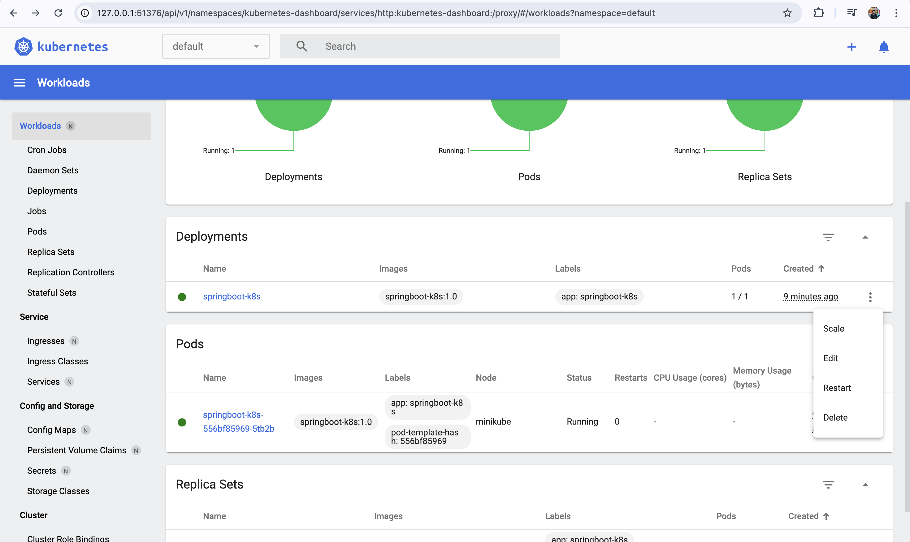

# Kubernetes Deployment Guide

This guide outlines the steps to deploy a Spring Boot application on Kubernetes using both **kubectl commands** and **YAML configuration**.

## Prerequisites
- Docker installed and running
- Minikube installed
- Kubernetes CLI (`kubectl`) installed

## Step 1: Verify Minikube Installation
```sh
minikube version
```
#### Sample Output:
```
minikube version: v1.35.0
commit: dd5d320e41b5451cdf3c01891bc4e13d189586ed-dirty
```

## Step 2: Start Minikube Cluster
```sh
minikube start
```
#### Sample Output:
```
😄  minikube v1.35.0 on Darwin 15.3.1 (arm64)
✨  Automatically selected the docker driver
📌  Using Docker Desktop driver with root privileges
👍  Starting "minikube" primary control-plane node in "minikube" cluster
...
🏄  Done! kubectl is now configured to use "minikube" cluster and "default" namespace by default
```

## Step 3: Check Minikube Status
```sh
minikube status
```
#### Sample Output:
```
minikube
  type: Control Plane
  host: Running
  kubelet: Running
  apiserver: Running
  kubeconfig: Configured
```

## Step 4: Get Kubernetes Cluster Info
```sh
kubectl cluster-info
```
#### Sample Output:
```
Kubernetes control plane is running at https://127.0.0.1:51184
CoreDNS is running at https://127.0.0.1:51184/api/v1/namespaces/kube-system/services/kube-dns:dns/proxy
```

## Step 5: Check Kubernetes Nodes
```sh
kubectl get nodes
```
#### Sample Output:
```
NAME       STATUS   ROLES           AGE   VERSION
minikube   Ready    control-plane   70s   v1.32.0
```

## Step 6: Use Minikube's Docker Daemon
```sh
eval $(minikube -p minikube docker-env)
```
This configures Docker CLI to use Minikube’s internal Docker daemon.

### Verify Docker Images
```sh
docker images
```
#### Sample Output:
```
REPOSITORY                                TAG        IMAGE ID       CREATED        SIZE
springboot-k8s                            1.0        3381fc5cbbad   32 seconds ago   539MB
```

## Step 7: Build and Deploy Spring Boot Application
```sh
docker build -t springboot-k8s:1.0 .
```
This builds the Spring Boot application inside Minikube’s Docker daemon.

### Verify Docker Image
```sh
docker images
```

## Step 8: Create Kubernetes Deployment
```sh
kubectl create deployment springboot-k8s --image=springboot-k8s:1.0 --port=9090
```
---
```sh
kubectl apply -f k8s-deployment.yaml
```

#### Verify Deployment
```sh
kubectl get deployments
```
#### Sample Output:
```
NAME              READY   UP-TO-DATE   AVAILABLE   AGE
spring-boot-k8s   3/3     3            3           23s
springboot-k8s    1/1     1            1           30m
```

## Step 9: View Running Pods
```sh
kubectl get pods
```
#### Sample Output:
```
NAME                              READY   STATUS    RESTARTS   AGE
spring-boot-k8s-db89b8d59-jwtsr   1/1     Running   0          49s
spring-boot-k8s-db89b8d59-k2jh9   1/1     Running   0          49s
spring-boot-k8s-db89b8d59-xjskx   1/1     Running   0          49s
springboot-k8s-556bf85969-5tb2b   1/1     Running   0          30m
```

## Step 10: Check Logs of the Running Application
```sh
kubectl logs <pod-name>
```
Example:
```sh
kubectl logs springboot-k8s-556bf85969-5tb2b
```

#### Sample Output:
```
  .   ____          _            __ _ _
 /\\ / ___'_ __ _ _(_)_ __  __ _ \ \ \ \
( ( )\___ | '_ | '_| | '_ \/ _ | \ \ \ \
 \\/  ___)| |_)| | | | | || (_| |  ) ) ) )
  '  |____| .__|_| |_|_| |_\__, | / / / /
 =========|_|==============|___/=/_/_/_/

 :: Spring Boot ::                (v3.4.3)

2025-02-27T16:26:23.512Z  INFO 1 --- [SpringBoot-Kubernetes] [           main] c.m.web.SpringBootKubernetesApplication  : Starting SpringBootKubernetesApplication v0.0.1-SNAPSHOT using Java 21 with PID 1 (/application.jar started by root in /)
2025-02-27T16:26:23.577Z  INFO 1 --- [SpringBoot-Kubernetes] [           main] c.m.web.SpringBootKubernetesApplication  : No active profile set, falling back to 1 default profile: "default"
2025-02-27T16:26:25.087Z  INFO 1 --- [SpringBoot-Kubernetes] [           main] o.s.b.w.embedded.tomcat.TomcatWebServer  : Tomcat initialized with port 9090 (http)
2025-02-27T16:26:25.098Z  INFO 1 --- [SpringBoot-Kubernetes] [           main] o.apache.catalina.core.StandardService   : Starting service [Tomcat]
2025-02-27T16:26:25.099Z  INFO 1 --- [SpringBoot-Kubernetes] [           main] o.apache.catalina.core.StandardEngine    : Starting Servlet engine: [Apache Tomcat/10.1.36]
2025-02-27T16:26:25.132Z  INFO 1 --- [SpringBoot-Kubernetes] [           main] o.a.c.c.C.[Tomcat].[localhost].[/]       : Initializing Spring embedded WebApplicationContext
2025-02-27T16:26:25.132Z  INFO 1 --- [SpringBoot-Kubernetes] [           main] w.s.c.ServletWebServerApplicationContext : Root WebApplicationContext: initialization completed in 1435 ms
2025-02-27T16:26:25.777Z  INFO 1 --- [SpringBoot-Kubernetes] [           main] o.s.b.w.embedded.tomcat.TomcatWebServer  : Tomcat started on port 9090 (http) with context path '/'
2025-02-27T16:26:25.787Z  INFO 1 --- [SpringBoot-Kubernetes] [           main] c.m.web.SpringBootKubernetesApplication  : Started SpringBootKubernetesApplication in 2.975 seconds (process running for 3.569)
```

## Step 11: Expose Deployment as a Service
```sh
kubectl expose deployment springboot-k8s --type=NodePort
```
---

```sh
kubectl apply -f k8s-service.yaml
```

#### Verify Service
```sh
kubectl get services
```
#### Sample Output:
```
NAME                     TYPE        CLUSTER-IP      EXTERNAL-IP   PORT(S)          AGE
kubernetes               ClusterIP   10.96.0.1       <none>        443/TCP          45m
springboot-k8s           NodePort    10.102.220.5    <none>        9090:32132/TCP   30m
springboot-k8s-service   NodePort    10.99.100.130   <none>        9090:31665/TCP   38s
```

## Step 12: Access the Application
```sh
minikube service springboot-k8s --url
```
---
```sh
minikube service springboot-k8s-service --url
```

#### Sample Output:
```
http://127.0.0.1:51365
```

## Step 13: Open Kubernetes Dashboard
```sh
minikube dashboard
```
#### Sample Output:
```
🔌  Enabling dashboard ...
🎉  Opening http://127.0.0.1:51376/api/v1/namespaces/kubernetes-dashboard/services/http:kubernetes-dashboard:/proxy/ in your default browser...
```


This launches the Kubernetes dashboard in a web browser.